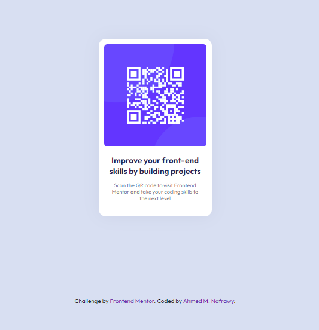

# Frontend Mentor - QR code component solution

This is a solution to the [QR code component challenge on Frontend Mentor](https://www.frontendmentor.io/challenges/qr-code-component-iux_sIO_H). Frontend Mentor challenges help you improve your coding skills by building realistic projects.

## Table of contents

- [Screenshot](#screenshot)
- [Links](#links)
- [My process](#my-process)
- [Built with](#built-with)
- [Author](#author)

### Screenshot

-

### Links

- Solution URL: [Add solution URL here](https://your-solution-url.com)
- Live Site URL: [Add live site URL here](https://your-live-site-url.com)

### Built with

- Semantic HTML5 markup
- CSS custom properties
- Flexbox
- Mobile-first workflow

### Useful resources

- [Example resource 1](https://developer.mozilla.org/en-US/docs/Web/CSS/box-shadow#formal_syntax) - This helped me for to know more about the box-shadow property. I really liked this pattern and will use it going forward..

## Author

- Frontend Mentor - [@Ahmed-Nafrawy](https://www.frontendmentor.io/profile/Ahmed-Nafrawy)
